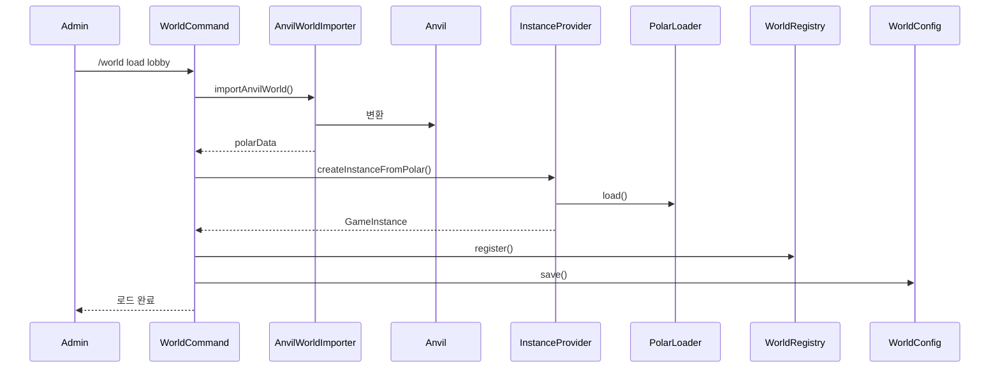
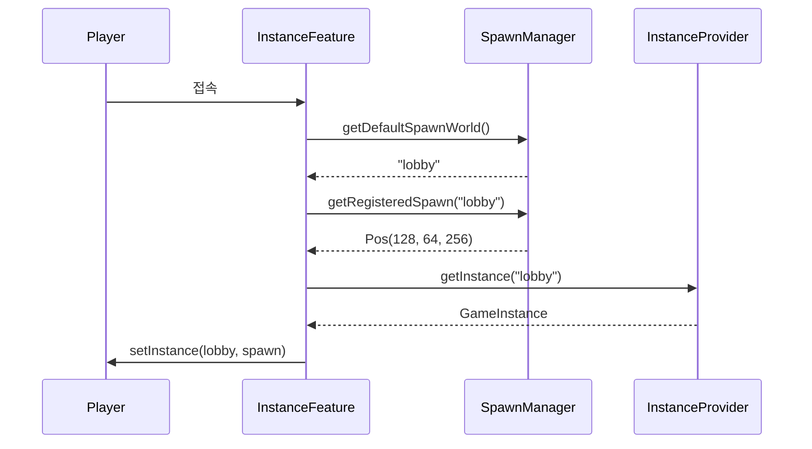

# Polar 월드 시스템 구현 프로젝트

> **프로젝트 기간**: 2026-02 ~ 진행중  
> **담당자**: 개발팀  
> **목표**: Minecraft 서버의 효율적인 월드 관리 시스템 구축

---

## 📋 목차

1. [[#프로젝트 개요]]
2. [[#비즈니스 요구사항]]
3. [[#기술 아키텍처]]
4. [[#구현 현황]]
5. [[#사용 가이드]]
6. [[#향후 계획]]

---

## 프로젝트 개요

### 배경

기존 Minecraft 서버는 월드 데이터 관리에 다음과 같은 문제점이 있었음:

- **저장 공간 비효율**: Anvil 포맷의 비압축 저장으로 인한 디스크 낭비
- **로딩 속도 저하**: 대용량 월드의 느린 로딩 시간
- **동적 관리 불가**: 런타임 중 월드 추가/제거 불가
- **재시작 시 설정 소실**: 서버 재시작 후 월드 및 스폰 설정 초기화

### 목표

1. **하이브리드 저장 전략**: 던전(파일시스템) + 개인 섬(MongoDB) 분리 관리
2. **Polar 포맷 도입**: Anvil 대비 70% 용량 절감 및 빠른 로딩
3. **동적 월드 관리**: 런타임 중 월드 로드/언로드 지원
4. **영구 설정 저장**: 서버 재시작 후에도 월드 및 스폰 설정 유지

---

## 비즈니스 요구사항

### 기능 요구사항

#### FR-001: 월드 저장소 추상화
- **우선순위**: 높음
- **설명**: 다양한 저장 백엔드를 지원하는 추상화 계층
- **구현**: `WorldStorage` 인터페이스

#### FR-002: Anvil → Polar 변환
- **우선순위**: 높음
- **설명**: 기존 Anvil 월드를 Polar 포맷으로 변환
- **구현**: `AnvilWorldImporter` 클래스

#### FR-003: 관리자 명령어
- **우선순위**: 중간
- **설명**: 월드 로드, 언로드, 텔레포트 등 관리 기능
- **구현**: `/world` 명령어 그룹

#### FR-004: 영구 설정 관리
- **우선순위**: 높음
- **설명**: 월드 및 스폰 설정의 영구 저장
- **구현**: `worlds.yml` 설정 파일

### 비기능 요구사항

#### NFR-001: 성능
- 월드 로딩 시간: 5초 이내 (5MB 기준)
- 메모리 사용량: 동시 로드 월드당 100MB 이하

#### NFR-002: 확장성
- 최대 동시 로드 월드: 50개
- MongoDB 용량: TB 단위 지원

#### NFR-003: 안정성
- 동시 저장 충돌 방지: 낙관적 잠금 적용
- 데이터 무결성: 압축 실패 시 롤백

---

## 기술 아키텍처

### 시스템 구성도

```
┌─────────────────────────────────────────────────┐
│              Minecraft 서버                      │
├─────────────────────────────────────────────────┤
│  WorldFeature (월드 관리)                        │
│  ├─ WorldRegistry (로드된 월드 추적)             │
│  ├─ WorldConfig (설정 파일 관리)                 │
│  └─ WorldCommand (관리자 명령어)                 │
├─────────────────────────────────────────────────┤
│  InstanceProvider (인스턴스 생성)                │
│  └─ createInstanceFromPolar()                   │
├─────────────────────────────────────────────────┤
│         WorldStorage (저장소 추상화)             │
│  ├─────────────────┬──────────────────┐         │
│  FileSystem        │      MongoDB     │         │
│  (던전 방)         │   (개인 섬)      │         │
├─────────────────────────────────────────────────┤
│              데이터 저장소                       │
│  worlds_polar/     │    MongoDB        │        │
│  └─ rooms/         │    ├─ islands    │        │
│     templates/     │    └─ compression │        │
└─────────────────────────────────────────────────┘
```

### 데이터 플로우

#### 1. 월드 로드 프로세스



#### 2. 플레이어 접속 프로세스



### 핵심 기술 스택

| 구분 | 기술 | 용도 |
|------|------|------|
| 월드 포맷 | Polar 1.15.0 | 경량 월드 저장 |
| 압축 | Zstd | MongoDB 데이터 압축 |
| 데이터베이스 | MongoDB | 개인 섬 저장 |
| 설정 관리 | SnakeYAML | worlds.yml 관리 |
| JSON 파싱 | Gson | 메타데이터 처리 |

---

## 구현 현황

### Phase 1-3: 기본 저장 시스템 ✅

**완료일**: 2026-02-17

#### 구현 내용

1. **WorldStorage 인터페이스**
   - 저장소 추상화 계층
   - 위치: `org.mcuniverse.api.world.WorldStorage`

2. **FileSystemWorldStorage**
   - 던전 방 템플릿 저장 (읽기 전용)
   - 경로: `worlds_polar/rooms/*.polar`

3. **MongoWorldStorage**
   - 개인 섬 저장 (읽기/쓰기)
   - Zstd 압축 적용 (70% 용량 절감)
   - 낙관적 잠금으로 동시성 제어

4. **InstanceProvider 확장**
   - `createInstanceFromPolar()` 메서드 추가
   - 임시 파일 방식으로 PolarLoader 호환

#### 기술적 고려사항

**문제**: Polar 라이브러리가 `Path` 기반 로딩만 지원  
**해결**: 임시 파일 생성 후 자동 삭제 메커니즘 구현

```java
Path tempFile = Files.createTempFile("polar_", ".polar");
Files.write(tempFile, polarData);
instance.setChunkLoader(new PolarLoader(tempFile));
Files.deleteIfExists(tempFile);
```

### Phase 4: Anvil 월드 임포트 ✅

**완료일**: 2026-02-17

#### 구현 내용

1. **AnvilWorldImporter**
   - `worlds/` 폴더의 Anvil 월드 스캔
   - Polar 포맷으로 자동 변환
   - 변환된 데이터 반환

2. **WorldRegistry**
   - 로드된 월드 추적 (메모리)
   - 월드 존재 여부 확인
   - 언로드 기능

#### 사용 예시

```java
// Anvil 월드 변환
byte[] polarData = AnvilWorldImporter.importAnvilWorld("lobby");

// 인스턴스 생성
GameInstance lobby = instanceProvider.createInstanceFromPolar("lobby", polarData);

// 레지스트리 등록
worldRegistry.register("lobby", lobby);
```

### Phase 5: 관리자 명령어 ✅

**완료일**: 2026-02-17

#### 명령어 목록

| 명령어 | 설명 | 권한 |
|--------|------|------|
| `/world load <name>` | Anvil 월드 로드 | ADMIN |
| `/world reload <name>` | 월드 리로드 | ADMIN |
| `/world import <src> <dst>` | Anvil→Polar 변환 저장 | ADMIN |
| `/world tp <name>` | 월드 텔레포트 | ADMIN |
| `/world list` | 로드된 월드 목록 | ADMIN |
| `/world available` | 사용 가능한 월드 | ADMIN |
| `/world setspawn <name>` | 스폰 위치 설정 | ADMIN |

#### 구현 세부사항

- **권한 시스템**: `@RequiresRank("ADMIN")` 어노테이션
- **에러 핸들링**: 사용자 친화적 메시지
- **자동 저장**: 설정 자동 저장 기능

### Phase 6: 영구 설정 관리 ✅

**완료일**: 2026-02-17

#### 구현 내용

1. **WorldConfig 클래스**
   - `worlds.yml` 파일 파싱
   - 자동 로드 월드 목록 관리
   - 스폰 좌표 저장

2. **SpawnManager 확장**
   - 전역 스폰 레지스트리
   - 월드별 스폰 좌표 관리
   - 기본 스폰 월드 설정

3. **자동 로드 시스템**
   - 서버 시작 시 `worlds.yml` 읽기
   - 설정된 월드 자동 로드
   - 스폰 좌표 자동 적용

4. **InstanceFeature 수정**
   - 설정된 스폰 월드로 플레이어 이동
   - Fallback 메커니즘 구현

#### worlds.yml 포맷

```yaml
# 자동 로드할 월드
autoload:
  - name: "lobby"
    type: "anvil"
    spawn:
      x: 128.5
      y: 64.0
      z: 256.0
      yaw: 0.0
      pitch: 0.0

# 기본 스폰 월드
default_spawn_world: "lobby"
```

---

## 사용 가이드

### 관리자 워크플로우

#### 1. 새 월드 추가

```bash
# 1. worlds/ 폴더에 Anvil 월드 복사
cp -r my_lobby worlds/lobby

# 2. 서버에서 로드
/world load lobby
# → worlds.yml에 자동 추가됨

# 3. 스폰 위치 설정
# (원하는 위치로 이동 후)
/world setspawn lobby
# → worlds.yml에 좌표 저장됨
```

#### 2. 월드 관리

```bash
# 로드된 월드 확인
/world list

# 사용 가능한 월드 확인
/world available

# 월드로 이동 (저장된 스폰으로)
/world tp lobby

# 월드 리로드 (수정 후)
/world reload lobby
```

#### 3. Polar 템플릿 생성

```bash
# Anvil 월드를 Polar로 변환하여 저장
/world import lobby lobby_template
# → worlds_polar/templates/lobby_template.polar

# 다음 재시작 시 빠른 로딩 가능
```

### 운영 시나리오

#### 이벤트 월드 추가

1. **준비**: 외부에서 월드 제작 (WorldEdit 등)
2. **배포**: `worlds/event_pvp/` 폴더에 업로드
3. **로드**: `/world load event_pvp`
4. **설정**: `/world setspawn event_pvp`
5. **공지**: 플레이어에게 `/world tp event_pvp` 안내

#### 정기 업데이트

1. **백업**: 기존 월드 백업
2. **교체**: 새 월드로 교체
3. **리로드**: `/world reload lobby`
4. **확인**: `/world tp lobby`로 검증

### 개발자 참고사항

#### 월드 데이터 접근

```java
// WorldFeature에서 저장소 가져오기
WorldStorage rooms = worldFeature.getFileSystemStorage();
WorldStorage islands = worldFeature.getMongoStorage();

// 월드 레지스트리 접근
WorldRegistry registry = worldFeature.getWorldRegistry();
Optional<GameInstance> instance = registry.get("lobby");
```

#### 새 월드 타입 추가

```java
// WorldConfig.WorldEntry 확장
config.addWorld("my_world", "polar", spawn);

// 자동 로드 로직에서 처리
if ("polar".equals(entry.getType())) {
    polarData = fileStorage.loadWorld("templates/" + entry.getName());
}
```

---

## 향후 계획

### 단기 (1개월 이내)

- [ ] **청크 복사 로직 구현**
  - PolarRoomAssembler의 TODO 해결
  - 던전 방 조합 기능 완성

- [ ] **메모리 최적화**
  - 월드 캐싱 전략 수립
  - 비활성 월드 자동 언로드

- [ ] **모니터링 추가**
  - 월드 로딩 시간 측정
  - 메모리 사용량 추적

### 중기 (3개월 이내)

- [ ] **사용자 명령어**
  - `/island create` - 개인 섬 생성
  - `/island home` - 개인 섬 이동
  - `/dungeon join` - 던전 참여

- [ ] **MongoDB 최적화**
  - 인덱스 추가
  - 압축 비율 튜닝
  - 샤딩 고려

- [ ] **관리 UI**
  - 웹 기반 월드 관리 패널
  - 실시간 통계 대시보드

### 장기 (6개월 이상)

- [ ] **멀티 서버 지원**
  - Redis 기반 월드 공유
  - 서버 간 텔레포트

- [ ] **자동 백업**
  - 일일 백업 스케줄러
  - S3 연동

- [ ] **성능 벤치마크**
  - 대규모 부하 테스트
  - 병목 지점 개선

---

## 기술 부채 및 알려진 이슈

### 기술 부채

1. **PolarRoomAssembler 청크 복사**
   - **상태**: TODO
   - **영향**: 던전 방 조합 불가
   - **우선순위**: 높음
   - **예상 공수**: 3일

2. **임시 파일 방식**
   - **상태**: 개선 필요
   - **영향**: 디스크 I/O 오버헤드
   - **우선순위**: 중간
   - **대안**: Polar 라이브러리에 메모리 로딩 기능 PR

### 알려진 이슈

- ❌ **대용량 월드 로딩 시간**
  - 100MB 이상 월드는 10초 이상 소요
  - 해결 방안: 비동기 로딩 + 진행률 표시

---

## 팀 협업 노트

### 코드 리뷰 체크리스트

- [ ] 모든 `WorldStorage` 구현은 예외 처리 포함
- [ ] MongoDB 작업은 낙관적 잠금 적용
- [ ] 임시 파일은 반드시 자동 삭제
- [ ] 설정 변경 시 `worlds.yml` 저장
- [ ] 명령어는 권한 체크 포함

### 테스트 시나리오

1. **월드 로드 테스트**
   - 5MB, 50MB, 100MB 월드 로딩 시간 측정
   - 동시 10개 월드 로드 안정성

2. **동시성 테스트**
   - 10명이 동시에 개인 섬 저장
   - 충돌 발생 시 롤백 확인

3. **재시작 테스트**
   - 서버 재시작 후 월드 자동 로드
   - 스폰 위치 유지 확인

### 배포 체크리스트

- [ ] `MONGODB_URI` 환경 변수 설정
- [ ] `worlds_polar/` 디렉토리 생성
- [ ] `worlds.yml` 초기 설정
- [ ] 기존 Anvil 월드 백업
- [ ] 로그 레벨 확인 (INFO 이상)

---

## 참고 자료

### 외부 문서

- [Polar 라이브러리 문서](https://github.com/hollow-cube/polar)
- [Zstd 압축 알고리즘](https://facebook.github.io/zstd/)
- [MongoDB 낙관적 잠금](https://www.mongodb.com/docs/manual/core/transactions/)

### 내부 문서

- [[implementation_plan.md]] - 초기 설계 문서
- [[walkthrough.md]] - Phase 1-3 구현 과정
- [[anvil_import_plan.md]] - Phase 4-5 설계
- [[phase6_persistent_worlds.md]] - Phase 6 설계

### 코드 위치

```
src/main/java/org/mcuniverse/
├─ api/
│  ├─ instance/InstanceProvider.java
│  └─ world/
│     ├─ WorldStorage.java
│     ├─ RoomAssembler.java
│     └─ RoomMetadata.java
├─ plugins/
│  ├─ world/
│  │  ├─ WorldFeature.java
│  │  ├─ WorldRegistry.java
│  │  ├─ AnvilWorldImporter.java
│  │  ├─ PolarRoomAssembler.java
│  │  ├─ config/WorldConfig.java
│  │  ├─ command/WorldCommand.java
│  │  ├─ instance/InstanceFeature.java
│  │  └─ storage/
│  │     ├─ FileSystemWorldStorage.java
│  │     └─ MongoWorldStorage.java
│  └─ common/managers/SpawnManager.java
```

---

## 변경 이력

| 날짜 | Phase | 변경 내용 | 담당자 |
|------|-------|----------|--------|
| 2026-02-17 | Phase 1-3 | 기본 저장 시스템 구현 | 개발팀 |
| 2026-02-17 | Phase 4 | Anvil 임포트 추가 | 개발팀 |
| 2026-02-17 | Phase 5 | 관리자 명령어 구현 | 개발팀 |
| 2026-02-17 | Phase 6 | 영구 설정 관리 | 개발팀 |

---

**문서 버전**: 1.0  
**최종 업데이트**: 2026-02-17  
**다음 리뷰 예정**: 2026-02-24
